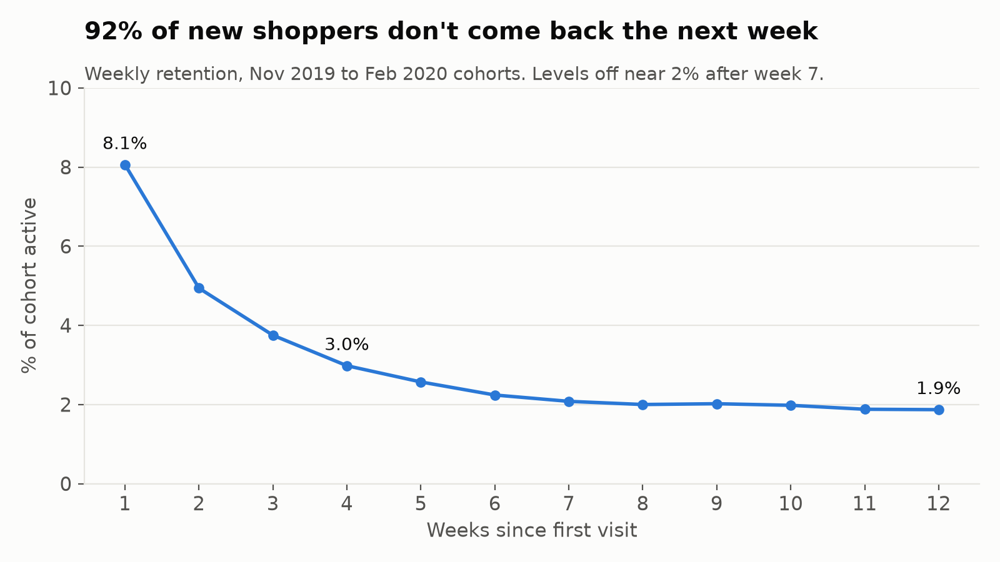
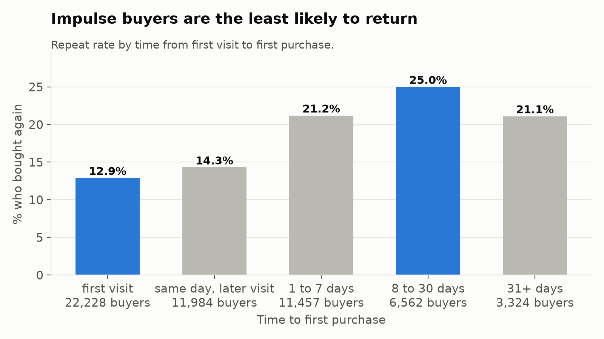

# Why don't shoppers come back?

A product analytics teardown of **20.7 million e-commerce events** using SQL in DuckDB.

I acted as the first data analyst at an online cosmetics store. The PM wanted to know where shoppers drop off, whether new customers stick around, and what repeat buyers do differently. I started from raw clickstream logs, built clean tables, defined the metrics myself, and wrote a one-page memo with recommendations.

**[Read the memo](memo/memo.md)**

## Key findings

- **92% of new shoppers don't come back the next week.** Retention levels off near 2% after week 7.
- **The biggest leak is view to cart.** Items over $15 are carted at less than half the rate of cheap items, but once carted they have the highest purchase rate.
- **Bigger first orders, twice the repeat rate.** 1-item first orders: 10% buy again. 11+ items: 23%.
- **Impulse buyers are the least loyal.** First-visit buyers repeat at 12.9%, vs 25% for shoppers who took 8 to 30 days.

## Questions

1. Do new shoppers come back? (weekly cohort retention)
2. Where do shoppers quit before buying? (session and product funnel)
3. What do repeat buyers do differently in their first visit and first order?
4. How fast do new shoppers buy, and does speed predict loyalty?

## Data

[eCommerce Events History in Cosmetics Shop](https://www.kaggle.com/datasets/mkechinov/ecommerce-events-history-in-cosmetics-shop) (Kaggle, REES46). About 20.7M events from Oct 2019 to Feb 2020: view, cart, remove_from_cart, purchase.

## Approach

1. **Loaded** 5 monthly CSVs into DuckDB.
2. **Checked data quality** and removed 1.2M bad rows: 1.1M exact duplicates, zero or negative prices, missing sessions, and sessions shared by multiple users. See [notes_data_quality.txt](notes_data_quality.txt).
3. **Defined metrics** before analysis: session, order, cohort, retention, conversion, repeat buyer. See [metrics.md](metrics.md).
4. **Built 4 clean tables:** events, sessions (4.5M), orders (156K), users (1.6M).
5. **Answered 4 questions** with SQL, with filters so every group had a fair amount of time to return.

## Repo structure

| File | What it does |
|---|---|
| `01_load_data.py` | Loads raw CSVs into DuckDB |
| `02_data_quality.py` | Data quality checks |
| `03_build_tables.py` | Builds clean events, sessions, orders, users tables |
| `04_q1_retention.py` to `07_q4_speed.py` | One script per question |
| `08_charts.py` | Makes all charts |
| `findings.md` | Detailed findings per question |
| `memo/memo.md` | One-page memo for the PM |

## How to run

## Limitations and next steps

- Findings 3 and 4 are correlations. The next step would be A/B tests of a starter bundle and a first-week re-engagement email.
- Category names are missing for 98% of events, so the funnel is split by price band and brand instead.
- Only 5 months of data, so long-term retention can't be measured.

**Tools:** SQL, DuckDB, Python (pandas, matplotlib), Git
