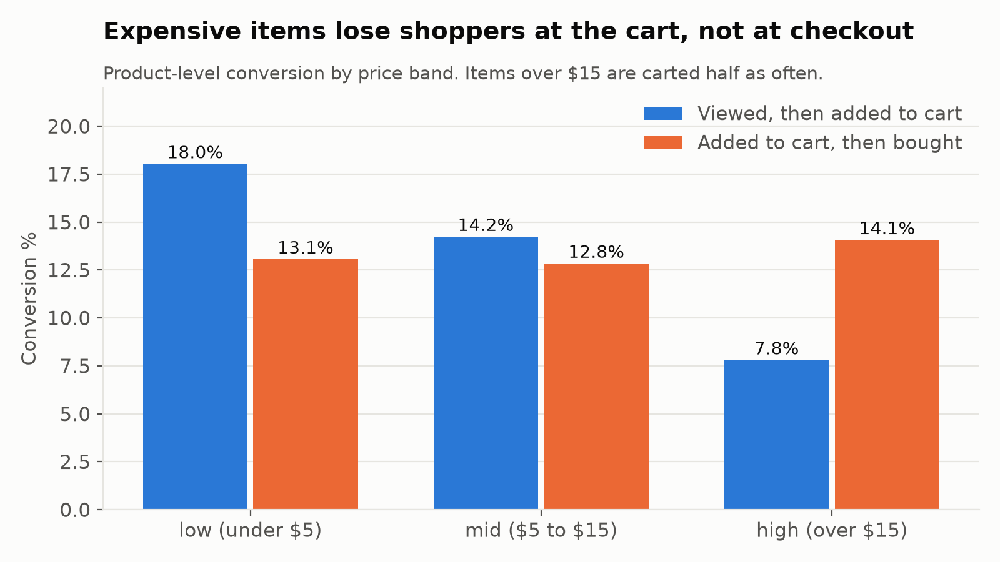
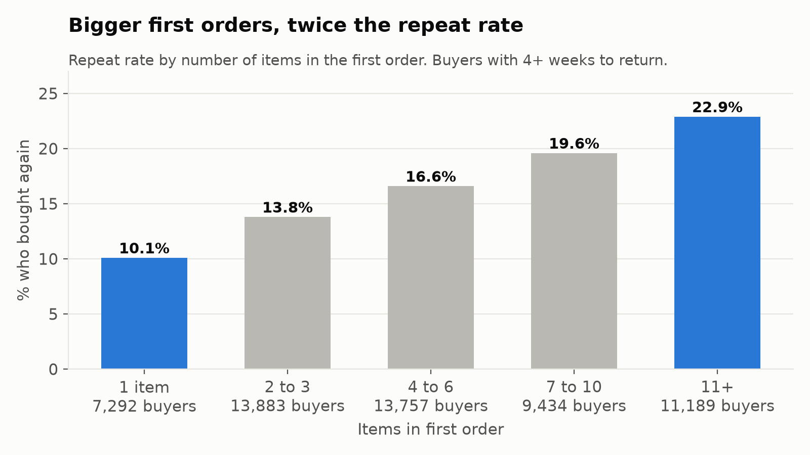

# Why don't shoppers come back?

**To:** Head of Product
**From:** Asthra Meadipudi, Data Analyst
**Data:** 20.7M clickstream events from an online cosmetics store, Oct 2019 to Feb 2020

## Bottom line

The store wins first visits but loses almost everyone after. **92% of new shoppers don't return the next week**, and only 6.6% ever buy. The shoppers who stay share a pattern: they come back before they buy, and their first order is bigger and spans more brands. **The first 7 days are where we should act.**

## What I found

**1. Retention drops fast, then levels off at about 2%.**
Week 1 retention is 8.1%, week 4 is 3.0%, and it flattens near 2% from week 7 on. December holiday cohorts end lowest (1.3 to 1.5% by weeks 10 to 12, vs 2.0 to 2.4% for early November).

**2. The biggest leak is view to cart, and it's worst for expensive items.**
Only 18.5% of sessions that view a product add anything to cart. Items over $15 are carted at 7.8%, less than half the rate of items under $5 (18%). But once carted, expensive items are bought at the highest rate (14.1%). Shoppers hesitate on the product page, not at checkout.

**3. Bigger, more varied first orders come with twice the repeat rate.**
1-item first orders: 10% buy again. 11+ items: 23%. Same pattern for brands (1 brand: 14%, 5+ brands: 23%) and value (under $10: 13%, $100+: 23%).

**4. Impulse buyers are the least loyal.**
Shoppers who bought on their first visit repeat at 12.9%. Those who took 8 to 30 days repeat at 25.0%. Coming back is the habit that predicts loyalty. Also, 79% of first purchases happen within 7 days of the first visit.

## What I recommend

| # | Action | Metric to watch | Baseline |
|---|---|---|---|
| 1 | **First-week program:** reminders for new visitors in days 1 to 7, and a "welcome back" offer right after a first-visit purchase | Week 1 retention | 8.1% |
| 2 | **Better product pages for items over $15:** reviews, more photos, samples | View to cart, high-price items | 7.8% |
| 3 | **Grow the first order:** cross-brand "complete the set" suggestions and a free shipping threshold near $30 | Repeat rate of new buyers | 16.8% |

Each should launch as an A/B test so we measure the real effect.

## Limitations

- Findings 3 and 4 are correlations, not proof. Big first-time buyers may already be more committed (some may be salon professionals). A/B tests would confirm cause.
- Only 5 months of data. October cohorts were excluded because those users may have visited earlier.
- Category names are missing for 98% of events and brand for 42%, so I split by price band instead.
- About 4% of sessions add to cart with no view event, which suggests tracking gaps.

## How I did it

SQL in DuckDB on a laptop. Removed 1.2M bad rows (including 1.1M exact duplicates), then built clean events, sessions, orders and users tables. Metric definitions are in `metrics.md`. Code is in scripts `01` to `08`.
